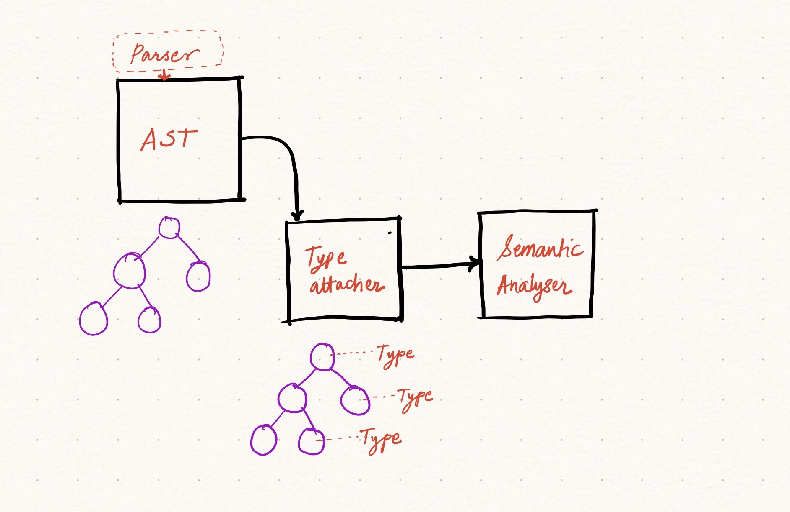

import { Image } from "astro:assets";
import { Aside, LinkCard } from "@astrojs/starlight/components";
import cover from "./images/types-2.jpg";

<Image
    src={cover}
    loading={"eager"}
    quality={"low"}
    alt="Cover"
    style="background:white"
/>

Types hold information about values used across a program. They denote the _type_ of a value, either primitive e.g. a string, a number or a boolean (true/false) or more complex forms like a list, a structure or a tuple. Types are used by the compiler to enforce certain rules that are defined by the programming language and also by the programmer to tell the compiler about the shape of a value.

```gom
import io;

function add(a: int, b: int): int {
    return a + b;
}

function main() {
    let a = 1;
    let b = add(a, a + 1);
    io.log(b);
}
```

In the program above, there are a bunch of type rules at play. For example, the function `add` requires two arguments that must be of type `int`. The compiler must ensure that this contract is upheld and any attempt at breaking it should be flagged as a type error. Similarly, when calling `add(a, a + 1)`, the expression `a + 1` could be confusing if seen independently. What if `a` is a string? The compiler can flag these mistakes very early rather than leading to an error at runtime.

How do you find the type of `a + 1` though? Semantically, it's quite simple. A sum operation on two `int`s should return another `int`. There would be many such rules the type system should use to determine types and correctness throughout the program.

## Everything has a type

Anything that can _return_ a value in a language should have a type. We will use this idea to attach types to every node in the abstract syntax tree and traverse the tree to enforce language rules as per types. Essentially, anything that can be treated as a _value_ in the language will have a type. Fundamentally, every `NodeTerm` will have either a primitive or complex type. Nodes that are made of child nodes that have types, may have a resultant type of their own - consider expressions. Every `NodeExpr` will have a type.



Let's talk code. We will create a new file under `src/types/index.ts` to store some type-specific entities that we can then attach to `Node`s.

```ts title=src/types/index.ts
export enum GomTypeKind {
  Deferred = "Deferred",
  PrimitiveOrAlias = "PrimitiveOrAlias",
  Tuple = "Tuple",
  Struct = "Struct",
  List = "List",
  Function = "Function",
}

export interface GomType {
  kind: GomTypeKind;
  toStr(): string;
  isEqual(other: GomType): boolean;
}
```

We define a new interface `GomType` which will be implemented by individual kinds of types listed in the enum `GomTypeKind`. We have `PrimitiveOrAlias` to group all primitive types (`int`, `str` etc.) and aliases to other types (`type LikeInt = int;`), three composite types to construct variables that are made up of sub-properties of various types, a `Function` type to denote function types and a `Deferred` type that will act as a fallback type for anything we do not have type information about yet.

Every type has to implement an important method named `isEqual`. It receives another type of unknown kind and the method should return true if the current and the argument type instances are the same. This equality check would differ for each kind as we will see later.

In `src/parser/rd/tree.ts`, let's update the `AbstractNode` abstract class to add a property `gomType` to store type information for each node in our AST.

```ts title=src/parser/rd/tree.ts ins={8}
export abstract class AbstractNode implements Node {
  readonly _id: number;
  type: NodeType;
  loc: number;
  parent?: Node;
  children: Node[];
  token?: Token;
  gomType: GomType;

  constructor() {
    this._id = globalNodeIdCounter++;
    this.type = NodeType.PROGRAM;
    this.loc = 0;
    this.children = [];
    this.gomType = new GomDeferredType("deferred", "unknown");
  }

  accept<T>(visitor: Visitor<T>): void {
    visitor.visit(this);
  }
}
```

## Implementing types
Next, let's implement various type kinds so that they can be used in the type checking visitor.

### Deferred type
This is our _default type_ assigned to all nodes during creation in the parser. We will take an easier route for type analysis and operate with the same syntax tree by updating the `gomType` value appropriately. Some compilers create new copies of ASTs with each pass in order to keep the state clean. To keep things simple, we will mutate the same tree structure in each _pass_ or traversal throughout our compiler.

```ts title=src/types/index.ts
export type GomDeferredTypeMarker =
  | "deferred"
  | "resolve_type"
  | "resolve_custom_type";
export class GomDeferredType implements GomType {
  kind: GomTypeKind;
  marker: GomDeferredTypeMarker;
  value: string;

  constructor(marker: GomDeferredTypeMarker, value: string) {
    this.kind = GomTypeKind.Deferred;
    this.marker = marker;
    this.value = value;
  }

  toStr(): string {
    return `${this.marker}(${this.value})`;
  }

  isEqual(_other: GomDeferredType): boolean {
    throw new Error("GomDeferredType should not be compared directly");
  }
}
```

Note that the deferred type has no real meaning - it is simply a placeholder type and hence cannot be compared with others. In addition, we'll also use this type to store intermediate type information about variables that we do not know enough about. Consider this small example:

```gom
let a = 1;
let b = a + 1;
```

These are two simple declaration statements, but how do we go from an AST that has a `NodeLetStatement` to determining that `a` is of type `int`? And further, how do we determine the type of `b` which uses `a`? It hints towards requiring some kind of storage for variables with necessary type information. This is exactly what we will need and is called a _symbol table_. We will discuss this in the next chapter, for now, we will assign `a` a deferred type with a special marker `resolve_type` such that we can recognize it later and react accordingly.

Similarly, when we have a custom type definition and then its usage, e.g. `let point: Point = { x: 1, y: 2 }`, we will first have to store all available custom types in the symbol table and then verify the correctness. For such cases, we'll use the `resolve_custom_type` marker.

### Primitive type

This type denotes either a primitive type or an alias.

```ts title=src/types/index.ts
export type GomPrimitiveTypeOrAliasValue =
  | "int"
  | "bool"
  | "float"
  | "str"
  | "void"
  | string;

export class GomPrimitiveTypeOrAlias implements GomType {
  kind: GomTypeKind;
  typeString: GomPrimitiveTypeOrAliasValue;

  constructor(typeString: GomPrimitiveTypeOrAliasValue) {
    this.kind = GomTypeKind.PrimitiveOrAlias;
    this.typeString = typeString;
  }

  isEqual(other: GomPrimitiveTypeOrAlias): boolean {
    if (other.kind !== GomTypeKind.PrimitiveOrAlias) {
      return false;
    }
    return this.typeString === other.typeString;
  }

  toStr(): string {
    return this.typeString;
  }
}
```

### List type
In Gom, we have lists which can be declared using the `[<type>]` syntax to hold a sequence of items of the _same_ type.

```gom
type Numbers = [int];
// and then used as:
let nums = Numbers { 1, 2, 3, 4 };

// OR list of structs
type Points = [{ x: int, y: int }];
```

We maintain a special property named `length` to store the size of the list. Note that the method `isEqual` compares two types and not values - it checks if the passed type is the same as the current type.

```ts title=src/types/index.ts
export class GomListType implements GomType {
  name: string;
  kind: GomTypeKind;
  elementType: GomType;
  static readonly SIZE_PROPERTY = "length";

  constructor(name: string, elementType: GomType) {
    this.name = name;
    this.kind = GomTypeKind.List;
    this.elementType = elementType;
  }

  isEqual(other: GomListType): boolean {
    if (other.kind !== GomTypeKind.List) {
      return false;
    }
    return this.elementType.isEqual(other.elementType);
  }

  toStr(): string {
    return `[${this.elementType.toStr()}]`;
  }

  static isBuiltInProperty(name: string): boolean {
    return [GomListType.SIZE_PROPERTY].includes(name);
  }

  static builtInPropertyType(name: string): GomType {
    switch (name) {
      case GomListType.SIZE_PROPERTY:
        return new GomPrimitiveTypeOrAlias("int");
      default:
        throw new Error(`Unknown list property: ${name}`);
    }
  }
}
```

### Tuple and struct types

Tuples are used to store values of different types together in a data structure. Structs are tuples with named properties. Gom does not have special keywords to declare these types but rather uses the syntactic definition to recognize the difference.

```gom
// Tuple
type Pair = { int, int };

// Struct
type Status = {
  code: int,
  success: bool,
};
```

```ts title=src/types/index.ts
export class GomTupleType implements GomType {
  kind: GomTypeKind;
  fields: Map<string, GomType>;

  constructor(fields: GomType[]) {
    this.kind = GomTypeKind.Tuple;
    this.fields = fields.reduce((acc, field, i) => {
      acc.set(i.toString(), field);
      return acc;
    }, new Map<string, GomType>());
  }

  isEqual(other: GomTupleType): boolean {
    if (other.kind !== GomTypeKind.Tuple) {
      return false;
    }
    if (this.fields.size !== other.fields.size) {
      return false;
    }
    for (let i = 0; i < this.fields.size; i++) {
      const otherField = other.fields.get(i.toString());
      assert(otherField);
      if (!this.fields.get(i.toString())?.isEqual(otherField)) {
        return false;
      }
    }
    return true;
  }

  toStr(): string {
    return `{ ${Array.from(this.fields)
      .map((field) => field[1].toStr())
      .join(", ")} }`;
  }
}
```

```ts title=src/types/index.ts
export class GomStructType implements GomType {
  kind: GomTypeKind;
  name: string;
  fields: Map<string, GomType>;

  constructor(name: string, fields: Map<string, GomType>) {
    this.name = name;
    this.kind = GomTypeKind.Struct;
    this.fields = fields;
  }

  toStr(): string {
    return `struct { ${Object.entries(this.fields)
      .map(([name, type]) => `${name}: ${type.toStr()}`)
      .join(", ")} }`;
  }

  isEqual(other: GomStructType): boolean {
    if (this.fields.size !== other.fields.size) {
      return false;
    }

    for (const [name, type] of Object.entries(this.fields)) {
      if (!other.fields.has(name) || !type.isEqual(other.fields.get(name))) {
        return false;
      }
    }

    return true;
  }
}
```

### Function type

Functions are special types and many languages handle them differently. We will keep them simple in Gom for now but would keep an option open to use functions as values in the future. The function type denotes a function with its core attributes: name, arguments (with their types) and return type.

```ts title=src/types/index.ts
export class GomFunctionType implements GomType {
  kind: GomTypeKind;
  args: GomType[];
  returnType: GomType;

  constructor(args: GomType[], returnType: GomType) {
    this.kind = GomTypeKind.Function;
    this.args = args;
    this.returnType = returnType;
  }

  isEqual(other: GomFunctionType): boolean {
    if (other.kind !== GomTypeKind.Function) {
      return false;
    }
    if (this.args.length !== other.args.length) {
      return false;
    }
    for (let i = 0; i < this.args.length; i++) {
      if (!this.args[i].isEqual(other.args[i])) {
        return false;
      }
    }

    return this.returnType.isEqual(other.returnType as GomType);
  }

  toStr(): string {
    return `(${this.args
      .map((arg) => arg.toStr())
      .join(", ")}) => ${this.returnType.toStr()}`;
  }

  /**
    * Ignore this for now, we will need this later
    * during code generation phase.
    */
  usesSret(): boolean {
    return (
      this.returnType instanceof GomStructType ||
      this.returnType instanceof GomCompositeType ||
      this.returnType instanceof GomTupleType
    );
  }
}
```

## Attaching types to nodes
Now that we have all the types defined and ready to be used, let's see how we can go about attaching types to nodes in the AST. The first step will be quite simple because we don't know a lot about the type of the values in the tree yet, so we will have to work with what we know.

We will use a [visitor](/parsing-semantics/walking-the-ast/) again to traverse the tree and attach types wherever we know them for sure. If you think about this, the only values we definitely know types of are terminals that are literal values, e.g. numbers and strings - `1` or `"hello"`. For all other nodes, we would have to do some kind of _inference_ or store type information to retrieve it later.

In our first type system visitor, we will simply attach types for all terminals.

```ts
export class TypeAttacher extends SimpleVisitor<void> {
  private getTermGomType(node: NodeTerm): GomType {
    if (node.token.type === GomToken.IDENTIFIER) {
      return new GomDeferredType("resolve_type", node.token.value);
    } else if (node.token.type === GomToken.NUMLITERAL) {
      return new GomPrimitiveTypeOrAlias("int");
    } else if (node.token.type === GomToken.STRLITERAL) {
      return new GomPrimitiveTypeOrAlias("str");
    } else if (
      node.token.type === GomToken.TRUE ||
      node.token.type === GomToken.FALSE
    ) {
      return new GomPrimitiveTypeOrAlias("bool");
    } else if (node.token.type === GomToken.BUILT_IN_TYPE) {
      return new GomPrimitiveTypeOrAlias(node.token.value);
    }

    throw new Error(`Cannot determine type for token: ${node.token.type}`);
  }

  visitTerm(node: NodeTerm): void {
    const type = this.getTermGomType(node);
    node.gomType = type;
  }

  visitStructInit(node: NodeStructInit): void {
    this.visitChildren(node);
    node.gomType = new GomStructType(
      node.structTypeName.token.value,
      node.fields.reduce((acc, [field, expr]) => {
        acc.set(field.token.value, expr.gomType);
        return acc;
      }, new Map<string, GomType>()),
    );
  }

  visitCollectionInit(node: NodeCollectionInit): void {
    this.visitChildren(node);
    node.gomType = new GomListType(
      node.collectionTypeName.token.value,
      node.elements[0].gomType,
    );
  }

  visitTupleLiteral(node: NodeTupleLiteral): void {
    this.visitChildren(node);
    node.gomType = new GomTupleType(
      node.elements.map((element) => element.gomType),
    );
  }

  visitTypeDefinition(node: NodeTypeDefinition): void {
    this.visitChildren(node);
    node.gomType = node.rhs.gomType;
  }

  visitGomTypeStruct(node: NodeGomTypeStruct): void {
    this.visitChildren(node);
    node.gomType = new GomStructType(
      node.name.token.value,
      node.fields.reduce((acc, field) => {
        acc.set(field.name.value, field.fieldType.gomType);
        return acc;
      }, new Map<string, GomType>()),
    );
  }

  visitGomTypeList(node: NodeGomTypeList): void {
    this.visitChildren(node);
    node.gomType = new GomListType(
      node.name.token.value,
      node.elementType.gomType,
    );
  }

  visitGomTypeTuple(node: NodeGomTypeTuple): void {
    this.visitChildren(node);
    node.gomType = new GomTupleType(node.fields.map((field) => field.gomType));
  }

  visitGomTypeComposite(node: NodeGomTypeComposite): void {
    this.visitChildren(node);
    node.gomType = new GomListType(node.id.token.value, node.fields[0].gomType);
  }

  visitGomTypeStructField(node: NodeGomTypeStructField): void {
    this.visitChildren(node);
    node.gomType = node.fieldType.gomType;
  }

  visitGomTypeId(node: NodeGomTypeId): void {
    if (GOM_BUILT_IN_TYPES.has(node.id.token.value)) {
      node.gomType = new GomPrimitiveTypeOrAlias(node.id.token.value);
    } else {
      node.gomType = new GomDeferredType(
        "resolve_custom_type",
        node.id.token.value,
      );
    }
  }
}
```

We now have attached type information to all the terminal nodes in our AST, be it a `NodeTerm` or `NodeStructInit`. Note that for `NodeTerm`s which are identifiers, we use a deferred type with the `resovle_type` marker, and similarly in `visitGomTypeId`, we use `resolve_custom_type` if the type name is not one of the built-in types.

<LinkCard
    title="gom/src/types/index.ts"
    href="https://github.com/gom-lang/gom/blob/main/src/types/index.ts"
    description="Entire code for Gom's type system"
/>

---

Amazing! Now if you run the compile script, you should see the AST having some type information.

<Aside type="tip" title="Ready to Run">
Update `test.gom` with the following:

```gom title=test.gom
function main() {
  let a = 1;
  let b = "hello";
  let c = true;
}
```

Then run:

```bash
npm run compile test.gom
```
</Aside>

Our next step now is to further analyze the AST and build what we call the _symbol table_ - a data structure containing crucial information about all _symbols_ (variables and types) defined in the program. We will then use this information to assert language rules defined by Gom and then later also use it to generate LLVM IR. See you in the next chapter!