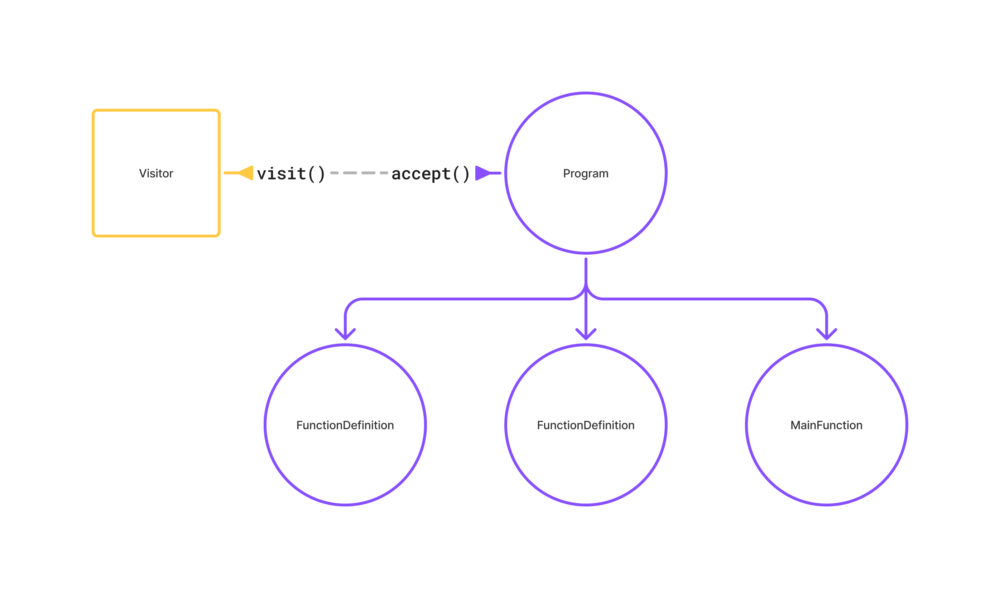

In the last two chapters we incrementally built the abstract syntax tree (AST) for our Gom program. Now that we have the AST, the root node being the `NodeProgram` object, we want to perform some analysis and operations using the valuable data collected inside each node of the tree.

One of the simplest use cases you can think of is doing type analysis. _Does the Gom program contain type-compatible expressions?_ E.g. does it contain an invalid addition expression - adding a string to an integer, or is an integer being passed to a function expecting a string? To answer such questions, among others, we need to somehow _traverse_ or _walk_ the tree while maintaining the relationship between nodes.

## Visitors

A popular pattern while traversing trees or graphs is to use _visitors_. Visitors are entities that define custom logic to be performed while "visiting" each node in the tree agnostic of the tree itself. This way the logic is separated from the data structure and allows you to build multiple visitors, each performing a specific task.

Let's build a simple visitor for our AST which prints the names of all functions in our program.



There are two main methods at play in the visitor pattern.

- Every node exposes an `accept(visitor)` method which accepts a visitor instance and states how the visitor will be applied.
- Every visitor exposes a `visit(node)` method which accepts a node and states what should be done with the node.

```ts title=visitor.ts
class FunctionPrintingVisitor extends Visitor {
  visit(node: Node) {
    if (node instanceof NodeFunctionDefinition) {
      console.log("Function", node.id.token.value);
    }
    node.children.forEach((child) => this.visit(child));
  }
}

class NodeFunctionDefinition extends Node {
  accept(visitor: Visitor) {
    visitor.visit(this);
  }
}
```

## Next steps

In the next few chapters we're going to use visitors to solve the following problems:

1. **Building a simple type system**: Enforcing type restrictions as defined by Gom
2. **Semantic analysis**: Enforcing other semantic rules, e.g. variable usage before declaration and correct number of arguments to a function call
